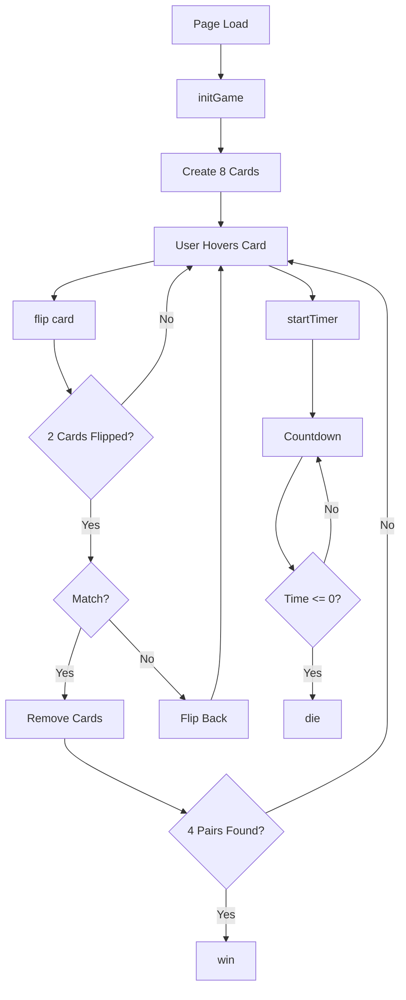

## Project Structure

Memorama WebVR is built as a single-page application using A-Frame for WebVR functionality. The entire game is contained within a single HTML file at `index.html:1`.

### Technology Stack

<Steps>
  <Step title="A-Frame 1.4.0">
    WebVR framework that provides declarative HTML-like syntax for 3D/VR scenes
  </Step>
  <Step title="Vanilla JavaScript">
    Pure JavaScript for game logic without external dependencies
  </Step>
  <Step title="HTML5 Assets">
    Images and audio files loaded through A-Frame's asset management system
  </Step>
</Steps>

## Architecture Layers

The application follows a three-layer architecture:

### 1. Presentation Layer (A-Frame Scene)

Defined in HTML using A-Frame entities from `index.html:8-52`:

```html
<a-scene fog="type: exponential; color: #0a0000; density: 0.15">
  <!-- Assets, entities, lights, and environment -->
</a-scene>
```

<Note>
  The A-Frame scene acts as the root container for all 3D objects, lighting, camera, and user interface elements.
</Note>

### 2. State Management Layer

Global game state variables defined at `index.html:60-65`:

```javascript
let timeLeft = 40;
let timerInterval;
let gameActive = false;
let pairsFound = 0;
let lockBoard = false; // Master lock to prevent race conditions
const cardData = ['img1', 'img1', 'img2', 'img2', 'img3', 'img3', 'img4', 'img4'];
```

| Variable | Type | Purpose |
|----------|------|----------|
| `timeLeft` | Number | Remaining seconds before game over |
| `timerInterval` | Interval | Reference to countdown timer |
| `gameActive` | Boolean | Prevents timer from starting multiple times |
| `pairsFound` | Number | Tracks matched pairs (win at 4) |
| `lockBoard` | Boolean | Critical lock preventing simultaneous card flips |
| `cardData` | Array | Card image IDs (4 pairs) |

### 3. Game Logic Layer

Core functions that control game flow:

<CardGroup cols={2}>
  <Card title="initGame()" icon="play" href="#initgame">
    Initializes board, shuffles cards, sets up event listeners
  </Card>
  <Card title="flip(card)" icon="rotate" href="#flip">
    Handles card flip animations and match logic
  </Card>
  <Card title="startTimer()" icon="clock" href="#starttimer">
    Begins countdown and background music
  </Card>
  <Card title="win()" icon="trophy" href="#win">
    Victory state - stops timer, shows success message
  </Card>
  <Card title="die()" icon="skull" href="#die">
    Defeat state - red overlay, shows failure message
  </Card>
</CardGroup>

## Data Flow



## Critical Design Patterns

### Board Locking Mechanism

The `lockBoard` variable at `index.html:64` prevents race conditions:

```javascript
if (lockBoard || this.dataset.flipped === "true" || timeLeft <= 0) return;
```

This pattern ensures:
- Only 2 cards can be flipped at once
- No interaction during match evaluation
- Clean state transitions

<Warning>
  Without `lockBoard`, users could flip 3+ cards simultaneously, breaking game logic
</Warning>

### Lazy Timer Initialization

The timer only starts on first interaction (`index.html:67-77`):

```javascript
function startTimer() {
    if(!gameActive) {
        gameActive = true;
        document.querySelector('#bgMusic').components.sound.playSound();
        timerInterval = setInterval(() => {
            timeLeft--;
            timerText.setAttribute('value', `VIDA: ${timeLeft}s`);
            if(timeLeft <= 0) die();
        }, 1000);
    }
}
```

This prevents the timer from running before the player engages with the game.

### Event-Driven Interactions

Cards use A-Frame's `mouseenter` event (`index.html:103`) triggered by VR gaze or mouse hover:

```javascript
card.addEventListener('mouseenter', function() {
    if (lockBoard || this.dataset.flipped === "true" || timeLeft <= 0) return;
    startTimer();
    new Audio(document.querySelector('#click-sound').src).play();
    flip(this);
});
```

## Performance Considerations

<AccordionGroup>
  <Accordion title="Asset Preloading">
    All images and audio files are preloaded in `<a-assets>` at `index.html:9-19`, preventing lag during gameplay.
  </Accordion>
  
  <Accordion title="Animation Timing">
    Card flip animations use precise timing (250ms flip, 125ms texture swap) to feel responsive without overwhelming the GPU.
  </Accordion>
  
  <Accordion title="Audio Optimization">
    Background music uses `loop: true` and `volume: 0.3` for continuous playback. Click sounds create new Audio instances to allow overlapping plays.
  </Accordion>
</AccordionGroup>

## File Organization

```
project/
├── index.html          # Complete game (HTML + JS + Scene)
├── img/
│   ├── img1.jpg        # Card face 1
│   ├── img2.jpg        # Card face 2
│   ├── img3.jpg        # Card face 3
│   ├── img4.jpg        # Card face 4
│   └── atras.jpeg      # Card back texture
├── piso.jpg            # Floor carpet texture
├── lados.jpg           # Wall stone texture
├── cartas.mp3          # Card flip sound effect
└── fondo.mp3           # Background music loop
```

<Note>
  The single-file architecture makes deployment trivial - just serve the folder with any static HTTP server.
</Note>