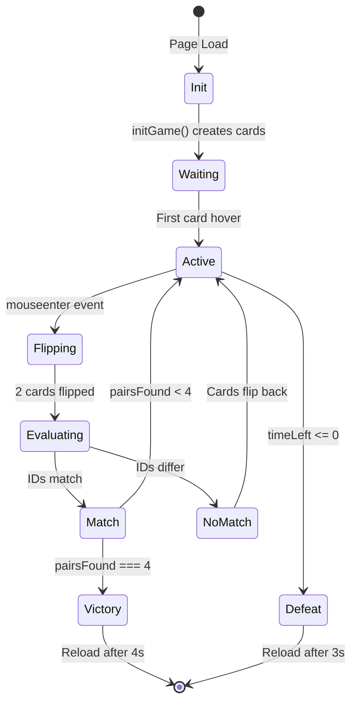

## Game State Variables

All game state is managed through global variables at `index.html:60-65`:

```javascript
let timeLeft = 40;
let timerInterval;
let gameActive = false;
let pairsFound = 0;
let lockBoard = false; // Master lock to prevent race conditions
const cardData = ['img1', 'img1', 'img2', 'img2', 'img3', 'img3', 'img4', 'img4'];
```

<CardGroup cols={2}>
  <Card title="timeLeft" icon="clock">
    Countdown timer starting at 40 seconds
  </Card>
  <Card title="timerInterval" icon="stopwatch">
    Reference to setInterval for cleanup
  </Card>
  <Card title="gameActive" icon="flag">
    Prevents multiple timer instances
  </Card>
  <Card title="pairsFound" icon="layer-group">
    Win condition tracker (0-4)
  </Card>
  <Card title="lockBoard" icon="lock">
    Critical flag preventing simultaneous flips
  </Card>
  <Card title="cardData" icon="images">
    Array of 4 pairs (8 cards total)
  </Card>
</CardGroup>

## Core Functions

### initGame()

Initializes the game board with shuffled cards. Defined at `index.html:86-113`:

```javascript
function initGame() {
    board.innerHTML = '';
    const shuffled = [...cardData].sort(() => Math.random() - 0.5);
    shuffled.forEach((imgId, index) => {
        const x = (index % 4) * 0.4; 
        const y = Math.floor(index / 4) * -0.6;
        const card = document.createElement('a-box');
        
        card.setAttribute('position', `${x} ${y} 0`);
        card.setAttribute('width', '0.35'); 
        card.setAttribute('height', '0.5'); 
        card.setAttribute('depth', '0.01');
        card.setAttribute('src', '#back');
        card.setAttribute('class', 'clickable');
        card.dataset.id = imgId;
        card.dataset.flipped = "false";

        card.addEventListener('mouseenter', function() {
            if (lockBoard || this.dataset.flipped === "true" || timeLeft <= 0) return;
            
            startTimer();
            new Audio(document.querySelector('#click-sound').src).play();
            flip(this);
        });
        board.appendChild(card);
    });
}
```

<Steps>
  <Step title="Clear existing board">
    `board.innerHTML = ''` removes any previous cards
  </Step>
  <Step title="Shuffle cards">
    Fisher-Yates shuffle using `sort(() => Math.random() - 0.5)`
  </Step>
  <Step title="Create 8 card entities">
    Each card is an `<a-box>` with position, size, texture, and data attributes
  </Step>
  <Step title="Attach event listeners">
    `mouseenter` triggers when VR cursor or mouse hovers over card
  </Step>
  <Step title="Append to board">
    Cards are added to the `#board` entity in the scene
  </Step>
</Steps>

#### Card Positioning Algorithm

From `index.html:90-91`:

```javascript
const x = (index % 4) * 0.4; 
const y = Math.floor(index / 4) * -0.6;
```

| Index | x | y | Grid Position |
|-------|---|---|---------------|
| 0 | 0 | 0 | Top-left |
| 1 | 0.4 | 0 | Top row |
| 2 | 0.8 | 0 | Top row |
| 3 | 1.2 | 0 | Top-right |
| 4 | 0 | -0.6 | Bottom-left |
| 5 | 0.4 | -0.6 | Bottom row |
| 6 | 0.8 | -0.6 | Bottom row |
| 7 | 1.2 | -0.6 | Bottom-right |

#### Guard Conditions

From `index.html:104`:

```javascript
if (lockBoard || this.dataset.flipped === "true" || timeLeft <= 0) return;
```

<AccordionGroup>
  <Accordion title="lockBoard">
    Prevents interaction while evaluating a pair of flipped cards
  </Accordion>
  <Accordion title="this.dataset.flipped === 'true'">
    Ignores already-flipped cards (prevents re-flipping matched pairs)
  </Accordion>
  <Accordion title="timeLeft <= 0">
    Disables interaction after game over
  </Accordion>
</AccordionGroup>

---

### startTimer()

Begins the countdown timer and background music. Defined at `index.html:67-77`:

```javascript
function startTimer() {
    if(!gameActive) {
        gameActive = true;
        document.querySelector('#bgMusic').components.sound.playSound();
        timerInterval = setInterval(() => {
            timeLeft--;
            timerText.setAttribute('value', `VIDA: ${timeLeft}s`);
            if(timeLeft <= 0) die();
        }, 1000);
    }
}
```

<Steps>
  <Step title="Check if timer already started">
    `if(!gameActive)` ensures timer only starts once
  </Step>
  <Step title="Set flag to active">
    `gameActive = true` prevents duplicate timers
  </Step>
  <Step title="Start background music">
    A-Frame's sound component plays the looping music track
  </Step>
  <Step title="Create interval">
    Decrements `timeLeft` every 1000ms (1 second)
  </Step>
  <Step title="Update HUD">
    Timer text updates to show remaining seconds
  </Step>
  <Step title="Check for game over">
    Calls `die()` when time reaches zero
  </Step>
</Steps>

<Note>
  The timer doesn't start automatically - it waits for the first card interaction at `index.html:107`
</Note>

---

### flip(card)

Handles card flip animation and match logic. Defined at `index.html:117-156`:

```javascript
let flippedCards = [];

function flip(card) {
    card.dataset.flipped = "true";
    flippedCards.push(card);

    // Clean flip animation
    card.setAttribute('animation', 'property: rotation; to: 0 180 0; dur: 250');
    setTimeout(() => card.setAttribute('src', '#' + card.dataset.id), 125);

    if (flippedCards.length === 2) {
        lockBoard = true; // TOTAL LOCK until pair is processed
        
        const [card1, card2] = flippedCards;

        if (card1.dataset.id === card2.dataset.id) {
            // IT'S A MATCH
            setTimeout(() => {
                card1.setAttribute('animation', 'property: scale; to: 0 0 0; dur: 300');
                card2.setAttribute('animation', 'property: scale; to: 0 0 0; dur: 300');
                pairsFound++;
                flippedCards = [];
                lockBoard = false; // RELEASE
                if (pairsFound === 4) win();
            }, 600);
        } else {
            // NOT A MATCH
            setTimeout(() => {
                card1.setAttribute('animation', 'property: rotation; to: 0 0 0; dur: 250');
                card2.setAttribute('animation', 'property: rotation; to: 0 0 0; dur: 250');
                setTimeout(() => {
                    card1.setAttribute('src', '#back');
                    card2.setAttribute('src', '#back');
                    card1.dataset.flipped = "false";
                    card2.dataset.flipped = "false";
                    flippedCards = [];
                    lockBoard = false; // RELEASE
                }, 125);
            }, 800);
        }
    }
}
```

#### Flip Animation Timeline

<Tabs>
  <Tab title="Initial Flip">
    ```javascript
    // At 0ms
    card.setAttribute('animation', 'property: rotation; to: 0 180 0; dur: 250');
    
    // At 125ms (halfway through rotation)
    setTimeout(() => card.setAttribute('src', '#' + card.dataset.id), 125);
    ```
    
    Card rotates 180° over 250ms. Texture swaps to card face at 125ms (halfway point) for smooth visual.
  </Tab>
  
  <Tab title="Match Found">
    ```javascript
    // Wait 600ms to show both cards
    setTimeout(() => {
        card1.setAttribute('animation', 'property: scale; to: 0 0 0; dur: 300');
        card2.setAttribute('animation', 'property: scale; to: 0 0 0; dur: 300');
        pairsFound++;
        flippedCards = [];
        lockBoard = false;
        if (pairsFound === 4) win();
    }, 600);
    ```
    
    Cards shrink to zero over 300ms, then are removed from play. Board unlocks after animation.
  </Tab>
  
  <Tab title="No Match">
    ```javascript
    // Wait 800ms to memorize
    setTimeout(() => {
        // Flip back over 250ms
        card1.setAttribute('animation', 'property: rotation; to: 0 0 0; dur: 250');
        card2.setAttribute('animation', 'property: rotation; to: 0 0 0; dur: 250');
        
        // At 125ms, swap texture back
        setTimeout(() => {
            card1.setAttribute('src', '#back');
            card2.setAttribute('src', '#back');
            card1.dataset.flipped = "false";
            card2.dataset.flipped = "false";
            flippedCards = [];
            lockBoard = false;
        }, 125);
    }, 800);
    ```
    
    800ms delay lets player memorize cards. Flip-back animation mirrors initial flip. Board unlocks after reset.
  </Tab>
</Tabs>

#### Board Locking Pattern

<Warning>
  **Critical**: `lockBoard = true` at `index.html:126` prevents clicking a 3rd card while evaluating the current pair.
</Warning>

```javascript
if (flippedCards.length === 2) {
    lockBoard = true; // Lock immediately
    // ... evaluate match ...
    lockBoard = false; // Unlock after animations complete
}
```

Without this lock:
- User could flip 3+ cards simultaneously
- `flippedCards` array would have >2 elements
- Match logic would break

---

### win()

Victory state handler. Defined at `index.html:158-162`:

```javascript
function win() {
    clearInterval(timerInterval);
    statusText.setAttribute('value', 'SALISTE CON VIDA');
    setTimeout(() => location.reload(), 4000);
}
```

<Steps>
  <Step title="Stop countdown">
    `clearInterval(timerInterval)` freezes timer
  </Step>
  <Step title="Display victory message">
    "SALISTE CON VIDA" ("You Escaped Alive") appears in large red text
  </Step>
  <Step title="Auto-restart">
    Game reloads after 4 seconds
  </Step>
</Steps>

Triggered at `index.html:138` when `pairsFound === 4`.

---

### die()

Defeat state handler. Defined at `index.html:79-84`:

```javascript
function die() {
    clearInterval(timerInterval);
    statusText.setAttribute('value', 'PERDISTE TU ALMA');
    deathOverlay.setAttribute('animation', 'property: material.opacity; to: 1; dur: 1000');
    setTimeout(() => location.reload(), 3000);
}
```

<Steps>
  <Step title="Stop countdown">
    `clearInterval(timerInterval)` stops the timer
  </Step>
  <Step title="Display defeat message">
    "PERDISTE TU ALMA" ("You Lost Your Soul") appears
  </Step>
  <Step title="Red fade effect">
    Death overlay fades from transparent to opaque red over 1 second
  </Step>
  <Step title="Auto-restart">
    Game reloads after 3 seconds
  </Step>
</Steps>

Triggered at `index.html:74` when `timeLeft <= 0`.

## Game Flow Diagram



## Timing Reference

| Event | Duration | Location |
|-------|----------|----------|
| Initial card flip | 250ms | `index.html:122` |
| Texture swap delay | 125ms | `index.html:123` |
| Match delay | 600ms | `index.html:132` |
| Match shrink animation | 300ms | `index.html:133-134` |
| No-match delay | 800ms | `index.html:142` |
| Flip-back animation | 250ms | `index.html:143-144` |
| Flip-back texture swap | 125ms | `index.html:145-151` |
| Death fade | 1000ms | `index.html:82` |
| Win reload | 4000ms | `index.html:161` |
| Death reload | 3000ms | `index.html:83` |
| Timer interval | 1000ms | `index.html:71` |

<Tip>
  All animation timings are carefully tuned for responsive feel without overwhelming the GPU or causing visual glitches.
</Tip>