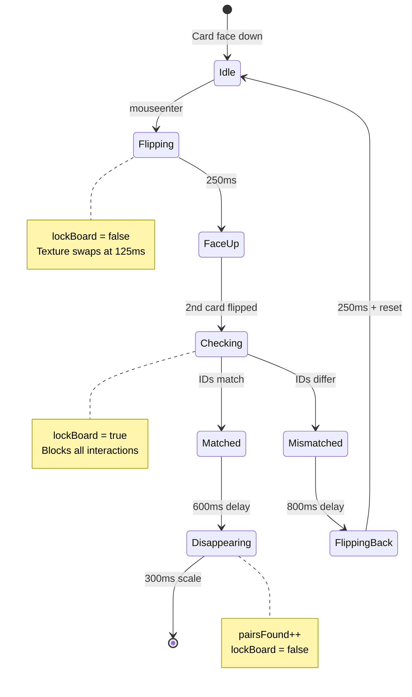

## Animation Overview

Memorama uses A-Frame's animation system for smooth visual transitions. All animations are triggered dynamically via JavaScript using `setAttribute('animation', ...)`.

## Scene Animations

### Flickering Light

The only static animation defined in HTML:

<ParamField path="flicker" type="a-light">
  Red point light that continuously flickers for horror atmosphere
  
  <ResponseField name="property" type="string" default="intensity">
    Animates the light intensity value
  </ResponseField>
  
  <ResponseField name="from" type="number" default="0.2">
    Minimum intensity (dim)
  </ResponseField>
  
  <ResponseField name="to" type="number" default="1.2">
    Maximum intensity (bright)
  </ResponseField>
  
  <ResponseField name="dur" type="number" default="150">
    Duration: 150ms per direction (very fast flicker)
  </ResponseField>
  
  <ResponseField name="loop" type="boolean" default="true">
    Loops continuously throughout the game
  </ResponseField>
  
  <ResponseField name="dir" type="string" default="alternate">
    Alternates between from → to → from
  </ResponseField>
</ParamField>

```html
<a-light id="flicker" type="point" intensity="1" position="0 3 0" color="#f00"
         animation="property: intensity; from: 0.2; to: 1.2; dur: 150; loop: true; dir: alternate"></a-light>
```

**Effect**: Creates rapid 0.3-second flicker cycles (150ms up, 150ms down)

## Card Animations

All card animations are applied dynamically via JavaScript:

### Card Flip (Front)

<ParamField path="flipToFront" type="animation">
  Rotates card to show face image
  
  <ResponseField name="property" type="string" default="rotation">
    Animates the rotation attribute
  </ResponseField>
  
  <ResponseField name="to" type="vec3" default="0 180 0">
    Rotates 180° around Y-axis
  </ResponseField>
  
  <ResponseField name="dur" type="number" default="250">
    Duration: 250ms (quarter second)
  </ResponseField>
</ParamField>

```javascript
card.setAttribute('animation', 'property: rotation; to: 0 180 0; dur: 250');
```

**Timing breakdown**:
- **0ms**: Animation starts, rotation begins
- **125ms**: Halfway through rotation (edge-on)
- **125ms**: Card texture changes to face image
- **250ms**: Animation completes, face fully visible

```javascript
card.setAttribute('animation', 'property: rotation; to: 0 180 0; dur: 250');
setTimeout(() => card.setAttribute('src', '#' + card.dataset.id), 125);
```

<Note>
  The texture swap happens at 125ms (midpoint) when the card is edge-on, creating a smooth visual transition without visible texture popping.
</Note>

### Card Flip (Back)

<ParamField path="flipToBack" type="animation">
  Rotates card back to show back texture (on mismatch)
  
  <ResponseField name="property" type="string" default="rotation">
    Animates the rotation attribute
  </ResponseField>
  
  <ResponseField name="to" type="vec3" default="0 0 0">
    Rotates back to 0° (original orientation)
  </ResponseField>
  
  <ResponseField name="dur" type="number" default="250">
    Duration: 250ms (same as flip front)
  </ResponseField>
</ParamField>

```javascript
card1.setAttribute('animation', 'property: rotation; to: 0 0 0; dur: 250');
card2.setAttribute('animation', 'property: rotation; to: 0 0 0; dur: 250');
```

**Triggered**: 800ms after second card flip (on mismatch)

### Card Match Disappear

<ParamField path="matchDisappear" type="animation">
  Shrinks matched cards to nothing
  
  <ResponseField name="property" type="string" default="scale">
    Animates the scale attribute
  </ResponseField>
  
  <ResponseField name="to" type="vec3" default="0 0 0">
    Scales to zero on all axes (disappears)
  </ResponseField>
  
  <ResponseField name="dur" type="number" default="300">
    Duration: 300ms
  </ResponseField>
</ParamField>

```javascript
card1.setAttribute('animation', 'property: scale; to: 0 0 0; dur: 300');
card2.setAttribute('animation', 'property: scale; to: 0 0 0; dur: 300');
```

**Triggered**: 600ms after match detected

### Death Overlay Fade

<ParamField path="deathFade" type="animation">
  Fades dark red overlay when player loses
  
  <ResponseField name="property" type="string" default="material.opacity">
    Animates material opacity
  </ResponseField>
  
  <ResponseField name="to" type="number" default="1">
    Fully opaque (from initial 0)
  </ResponseField>
  
  <ResponseField name="dur" type="number" default="1000">
    Duration: 1 second (slow dramatic fade)
  </ResponseField>
</ParamField>

```javascript
deathOverlay.setAttribute('animation', 'property: material.opacity; to: 1; dur: 1000');
```

**Triggered**: When `timeLeft <= 0` in `die()` function

## Animation Timing Diagrams

### Match Flow Timeline

```mermaid
gantt
    title Successful Match Animation (1200ms total)
    dateFormat X
    axisFormat %L ms
    
    section User Action
    Hover card 2 :0, 1
    
    section Cards Flip
    Flip animation :0, 250
    Texture swap :125, 126
    
    section Match Check
    lockBoard = true :250, 251
    Compare IDs :250, 251
    Wait (visual delay) :250, 600
    
    section Disappear
    Scale to 0 animation :600, 900
    pairsFound++ :900, 901
    lockBoard = false :900, 901
```



**Total duration**: 900ms from hover to board unlock

### Mismatch Flow Timeline

```mermaid
gantt
    title Mismatch Animation (1675ms total)
    dateFormat X
    axisFormat %L ms
    
    section User Action
    Hover card 2 :0, 1
    
    section Cards Flip
    Flip animation :0, 250
    Texture swap :125, 126
    
    section Mismatch Check
    lockBoard = true :250, 251
    Compare IDs (no match) :250, 251
    Wait (player sees cards) :250, 800
    
    section Flip Back
    Rotate to 0° :800, 1050
    Texture swap back :925, 926
    Reset flipped state :1050, 1175
    lockBoard = false :1175, 1176
```



**Total duration**: 1175ms from hover to board unlock

<Warning>
  The mismatch flow is intentionally longer (1175ms vs 900ms) to give players time to memorize the card positions.
</Warning>

## Timing Constants

### Card Flip Timing

<Tabs>
  <Tab title="Flip Duration">
    <ResponseField name="FLIP_DURATION" type="number" default="250">
      Card rotation animation length (ms)
      
      ```javascript
      card.setAttribute('animation', 'property: rotation; to: 0 180 0; dur: 250');
      ```
    </ResponseField>
  </Tab>
  
  <Tab title="Texture Swap Delay">
    <ResponseField name="TEXTURE_SWAP_DELAY" type="number" default="125">
      Delay before changing texture (half of flip duration)
      
      ```javascript
      setTimeout(() => card.setAttribute('src', '#' + card.dataset.id), 125);
      ```
      
      **Reason**: Swap happens at 90° rotation (edge-on) for smooth transition
    </ResponseField>
  </Tab>
  
  <Tab title="Post-Flip Delay">
    <ResponseField name="POST_FLIP_DELAY" type="number" default="125">
      Additional delay after flip back before resetting state
      
      ```javascript
      setTimeout(() => {
        card1.setAttribute('src', '#back');
        card1.dataset.flipped = "false";
        // ...
      }, 125);
      ```
      
      **Reason**: Ensures rotation completes before texture swap
    </ResponseField>
  </Tab>
</Tabs>

### Match Timing

<ResponseField name="MATCH_WAIT" type="number" default="600">
  Delay before starting disappear animation after match
  
  ```javascript
  if (card1.dataset.id === card2.dataset.id) {
    setTimeout(() => {
      card1.setAttribute('animation', 'property: scale; to: 0 0 0; dur: 300');
      // ...
    }, 600);
  }
  ```
  
  **Purpose**: Brief pause so player sees the match before cards vanish
</ResponseField>

<ResponseField name="MATCH_DISAPPEAR_DURATION" type="number" default="300">
  Duration of scale-to-zero animation
  
  **Total match sequence**: 600ms wait + 300ms animation = 900ms
</ResponseField>

### Mismatch Timing

<ResponseField name="MISMATCH_WAIT" type="number" default="800">
  Delay before flipping cards back on mismatch
  
  ```javascript
  else {
    setTimeout(() => {
      card1.setAttribute('animation', 'property: rotation; to: 0 0 0; dur: 250');
      // ...
    }, 800);
  }
  ```
  
  **Purpose**: Gives player time to memorize the card positions (critical for gameplay)
</ResponseField>

<ResponseField name="MISMATCH_FLIP_BACK_DURATION" type="number" default="250">
  Same as forward flip (symmetry)
  
  **Total mismatch sequence**: 800ms wait + 250ms flip + 125ms texture reset = 1175ms
</ResponseField>

## End Game Animations

### Game Over Screen

<ParamField path="gameOverSequence" type="sequence">
  Multi-step animation when timer reaches 0
  
  **Step 1 - Death overlay fade (0-1000ms)**:
  ```javascript
  deathOverlay.setAttribute('animation', 'property: material.opacity; to: 1; dur: 1000');
  ```
  
  **Step 2 - Page reload (3000ms)**:
  ```javascript
  setTimeout(() => location.reload(), 3000);
  ```
  
  **Total duration**: 3 seconds before reload

```mermaid
gantt
    title Game Over Animation Sequence
    dateFormat X
    axisFormat %L ms
    
    section Death
    Timer reaches 0 :0, 1
    Stop timer :0, 1
    Show "PERDISTE TU ALMA" :0, 1
    
    section Overlay
    Fade to opacity 1 :0, 1000
    Fully opaque :1000, 3000
    
    section Reload
    Page reload :3000, 3001
```

</ParamField>



### Victory Screen

<ParamField path="victorySequence" type="sequence">
  Animation when all pairs are found
  
  **No visual animation** - only text and timer:
  ```javascript
  function win() {
    clearInterval(timerInterval);
    statusText.setAttribute('value', 'SALISTE CON VIDA');
    setTimeout(() => location.reload(), 4000);
  }
  ```
  
  **Total duration**: 4 seconds before reload (1 second longer than game over)
</ParamField>

<Note>
  Victory sequence is 1 second longer (4s vs 3s) to let players savor their win.
</Note>

## Performance Considerations

### Animation Efficiency

<Tabs>
  <Tab title="Optimized">
    ✅ **GPU-accelerated properties used:**
    - `rotation` (transform)
    - `scale` (transform)
    - `material.opacity` (compositing)
    
    All animations use properties that don't trigger layout recalculation.
  </Tab>
  
  <Tab title="Durations">
    | Animation | Duration | FPS Target | Smoothness |
    |-----------|----------|------------|------------|
    | Card flip | 250ms | 60fps | Smooth |
    | Match disappear | 300ms | 60fps | Smooth |
    | Light flicker | 150ms | 60fps | Intentional jitter |
    | Death fade | 1000ms | 60fps | Very smooth |
  </Tab>
  
  <Tab title="Timing Strategy">
    **Why these durations?**
    
    - **250ms flip**: Fast enough to feel responsive, slow enough to see rotation
    - **600ms match wait**: Satisfying feedback without dragging
    - **800ms mismatch wait**: Long enough to memorize positions (core gameplay)
    - **150ms flicker**: Rapid enough to feel unsettling
    - **1000ms death fade**: Dramatic reveal
  </Tab>
</Tabs>

## Animation State Machine



## Complete Timing Reference

| Event | Delay | Duration | Total | Purpose |
|-------|-------|----------|-------|----------|
| Card flip start | 0ms | 250ms | 250ms | Visual rotation |
| Texture swap (flip) | 125ms | instant | - | Hide texture pop |
| Match detection | 250ms | instant | - | Compare IDs |
| Match wait | 250ms | 600ms | 850ms | Visual feedback |
| Match disappear | 850ms | 300ms | 1150ms | Satisfying exit |
| Mismatch wait | 250ms | 800ms | 1050ms | Memorization time |
| Flip back start | 1050ms | 250ms | 1300ms | Return to idle |
| Texture swap (back) | 1175ms | instant | - | Clean flip |
| State reset | 1175ms | instant | - | Unlock board |
| Death overlay | 0ms | 1000ms | 1000ms | Dramatic fade |
| Game over reload | 3000ms | instant | - | Reset game |
| Victory reload | 4000ms | instant | - | Celebrate longer |

## Code Reference

All animation timing values from `index.html:54-165`:

```javascript
// Card flip (line 122-123)
card.setAttribute('animation', 'property: rotation; to: 0 180 0; dur: 250');
setTimeout(() => card.setAttribute('src', '#' + card.dataset.id), 125);

// Match animation (line 132-138)
setTimeout(() => {
  card1.setAttribute('animation', 'property: scale; to: 0 0 0; dur: 300');
  card2.setAttribute('animation', 'property: scale; to: 0 0 0; dur: 300');
  // ...
}, 600);

// Mismatch animation (line 142-153)
setTimeout(() => {
  card1.setAttribute('animation', 'property: rotation; to: 0 0 0; dur: 250');
  card2.setAttribute('animation', 'property: rotation; to: 0 0 0; dur: 250');
  setTimeout(() => {
    // Reset state
  }, 125);
}, 800);

// Death overlay (line 82)
deathOverlay.setAttribute('animation', 'property: material.opacity; to: 1; dur: 1000');
```

## See Also

<CardGroup cols={2}>
  <Card title="A-Frame Components" icon="cube" href="/reference/aframe-components">
    Entity attributes animated by these timings
  </Card>
  <Card title="Game State" icon="database" href="/reference/game-state">
    JavaScript functions that trigger animations
  </Card>
</CardGroup>