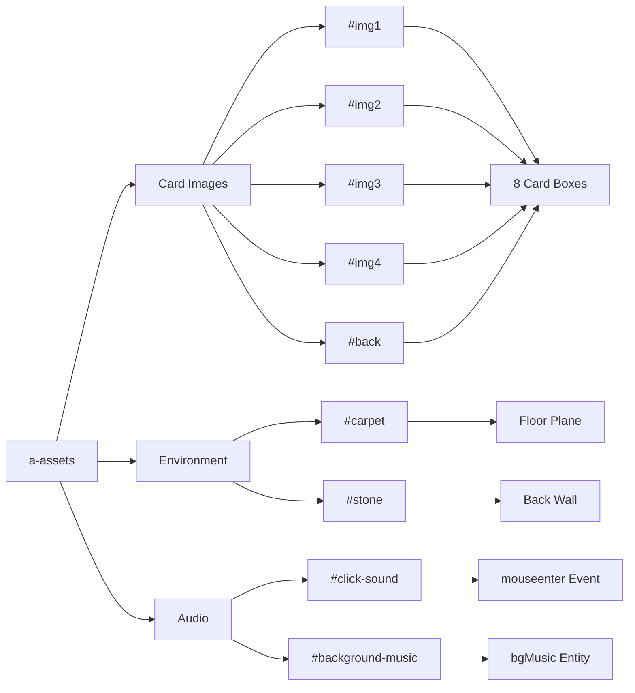

## Asset Management

All assets are preloaded using A-Frame's `<a-assets>` system for optimal performance.

```html
<a-assets>
  <!-- Images -->
  
  
  
  
  
  
  
  
  <!-- Audio -->
  <audio id="click-sound" src="cartas.mp3"></audio>
  <audio id="background-music" src="fondo.mp3" preload="auto"></audio>
</a-assets>
```

## Image Assets

### Card Face Images

The four unique card images for the memory game:

<ParamField path="img1" type="image">
  First card face image
  
  <ResponseField name="id" type="string" default="img1">
    Asset reference ID
  </ResponseField>
  
  <ResponseField name="src" type="string" default="img/img1.jpg">
    File path relative to index.html
  </ResponseField>
  
  <ResponseField name="fileSize" type="string" default="7,155 bytes">
    Optimized JPEG image
  </ResponseField>
  
  **Referenced by**: Card elements with `data-id="img1"`  
  **Pairs**: 2 cards use this image
</ParamField>

<ParamField path="img2" type="image">
  Second card face image
  
  <ResponseField name="id" type="string" default="img2">
    Asset reference ID
  </ResponseField>
  
  <ResponseField name="src" type="string" default="img/img2.jpg">
    File path relative to index.html
  </ResponseField>
  
  <ResponseField name="fileSize" type="string" default="10,973 bytes">
    Optimized JPEG image
  </ResponseField>
  
  **Referenced by**: Card elements with `data-id="img2"`  
  **Pairs**: 2 cards use this image
</ParamField>

<ParamField path="img3" type="image">
  Third card face image
  
  <ResponseField name="id" type="string" default="img3">
    Asset reference ID
  </ResponseField>
  
  <ResponseField name="src" type="string" default="img/img3.jpg">
    File path relative to index.html
  </ResponseField>
  
  <ResponseField name="fileSize" type="string" default="11,285 bytes">
    Optimized JPEG image
  </ResponseField>
  
  **Referenced by**: Card elements with `data-id="img3"`  
  **Pairs**: 2 cards use this image
</ParamField>

<ParamField path="img4" type="image">
  Fourth card face image
  
  <ResponseField name="id" type="string" default="img4">
    Asset reference ID
  </ResponseField>
  
  <ResponseField name="src" type="string" default="img/img4.jpg">
    File path relative to index.html
  </ResponseField>
  
  <ResponseField name="fileSize" type="string" default="7,689 bytes">
    Optimized JPEG image
  </ResponseField>
  
  **Referenced by**: Card elements with `data-id="img4"`  
  **Pairs**: 2 cards use this image
</ParamField>

### Card Back Image

<ParamField path="back" type="image">
  Card back texture shown on unflipped cards
  
  <ResponseField name="id" type="string" default="back">
    Asset reference ID
  </ResponseField>
  
  <ResponseField name="src" type="string" default="img/atras.jpeg">
    File path relative to index.html
  </ResponseField>
  
  <ResponseField name="fileSize" type="string" default="29,648 bytes">
    JPEG image
  </ResponseField>
  
  **Referenced by**: All cards initially (`card.setAttribute('src', '#back')`)  
  **Reset to**: After card mismatch
</ParamField>

```javascript
// Initial card state
card.setAttribute('src', '#back');

// After mismatch, flip back
card1.setAttribute('src', '#back');
card2.setAttribute('src', '#back');
```

### Environment Textures

<ParamField path="carpet" type="image">
  Casino floor texture
  
  <ResponseField name="id" type="string" default="carpet">
    Asset reference ID
  </ResponseField>
  
  <ResponseField name="src" type="string" default="piso.jpg">
    File path relative to index.html
  </ResponseField>
  
  <ResponseField name="fileSize" type="string" default="19,768 bytes">
    Optimized texture
  </ResponseField>
  
  **Applied to**: Floor plane (30m x 30m)
  
  ```html
  <a-plane src="#carpet" rotation="-90 0 0" width="30" height="30" color="#222"></a-plane>
  ```
</ParamField>

<ParamField path="stone" type="image">
  Stone wall texture
  
  <ResponseField name="id" type="string" default="stone">
    Asset reference ID
  </ResponseField>
  
  <ResponseField name="src" type="string" default="lados.jpg">
    File path relative to index.html
  </ResponseField>
  
  <ResponseField name="fileSize" type="string" default="90,444 bytes">
    Stone texture
  </ResponseField>
  
  **Applied to**: Back wall box (20m x 10m)
  
  ```html
  <a-box src="#stone" position="0 4 -6" width="20" height="10" depth="0.5" color="#333"></a-box>
  ```
</ParamField>

### Unused Assets

<Accordion title="marmol.jpg (Not in index.html)">
  A marble texture file exists in the source directory but is **not referenced** in the current version.
  
  - **Path**: `source/marmol.jpg`
  - **Size**: 755,201 bytes
  - **Status**: Unused (possibly legacy asset)
  
  To use this asset, add it to `<a-assets>`:
  ```html
  
  ```
</Accordion>

## Audio Assets

### Click Sound Effect

<ParamField path="click-sound" type="audio">
  Sound played when hovering over cards
  
  <ResponseField name="id" type="string" default="click-sound">
    Asset reference ID
  </ResponseField>
  
  <ResponseField name="src" type="string" default="cartas.mp3">
    File path relative to index.html
  </ResponseField>
  
  <ResponseField name="fileSize" type="string" default="30,929 bytes">
    MP3 audio file
  </ResponseField>
  
  <ResponseField name="preload" type="string">
    Not specified (default browser behavior)
  </ResponseField>
  
  **Triggered by**: Card `mouseenter` event  
  **Playback**: Creates new Audio instance each time
</ParamField>

```javascript
card.addEventListener('mouseenter', function() {
  // ...
  new Audio(document.querySelector('#click-sound').src).play();
  flip(this);
});
```

<Note>
  A new `Audio` object is created for each card hover, allowing overlapping sound effects if hovering quickly.
</Note>

### Background Music

<ParamField path="background-music" type="audio">
  Looping atmospheric music for the casino environment
  
  <ResponseField name="id" type="string" default="background-music">
    Asset reference ID
  </ResponseField>
  
  <ResponseField name="src" type="string" default="fondo.mp3">
    File path relative to index.html
  </ResponseField>
  
  <ResponseField name="fileSize" type="string" default="7,097,782 bytes">
    Large MP3 file (~7.1 MB)
  </ResponseField>
  
  <ResponseField name="preload" type="string" default="auto">
    Ensures music is loaded before gameplay
  </ResponseField>
  
  **Played via**: A-Frame sound component  
  **Started**: On first card hover via `startTimer()`
</ParamField>

```html
<a-entity id="bgMusic" sound="src: #background-music; loop: true; volume: 0.3"></a-entity>
```

```javascript
function startTimer() {
  if(!gameActive) {
    gameActive = true;
    document.querySelector('#bgMusic').components.sound.playSound();
    // ...
  }
}
```

<ResponseField name="loop" type="boolean" default="true">
  Music loops continuously until game ends
</ResponseField>

<ResponseField name="volume" type="number" default="0.3">
  30% volume (balanced with sound effects)
</ResponseField>

<Warning>
  The background music file is large (7MB). Consider compressing or using a streaming format for production.
</Warning>

## Asset Loading Strategy

### Preloading Behavior

A-Frame's `<a-assets>` system ensures all assets load before scene initialization:

1. **Images**: Loaded before any textures are applied
2. **Audio**: 
   - `click-sound`: Standard preload (browser default)
   - `background-music`: `preload="auto"` for immediate playback

### Performance Optimization

<Tabs>
  <Tab title="Image Sizes">
    | Asset | Size | Usage |
    |-------|------|-------|
    | img1.jpg | 7 KB | Card face |
    | img2.jpg | 11 KB | Card face |
    | img3.jpg | 11 KB | Card face |
    | img4.jpg | 8 KB | Card face |
    | atras.jpeg | 30 KB | Card back (all 8 cards) |
    | piso.jpg | 20 KB | Floor texture |
    | lados.jpg | 90 KB | Wall texture |
    | **Total Images** | **~177 KB** | |
  </Tab>
  
  <Tab title="Audio Sizes">
    | Asset | Size | Usage |
    |-------|------|-------|
    | cartas.mp3 | 31 KB | Click sound |
    | fondo.mp3 | 7.1 MB | Background music |
    | **Total Audio** | **~7.13 MB** | |
  </Tab>
  
  <Tab title="Recommendations">
    ### Optimization Suggestions
    
    ✅ **Images are well-optimized** (small file sizes)
    
    ⚠️ **Background music is large:**
    - Consider compressing to lower bitrate
    - Use OGG format as fallback for smaller size
    - Implement lazy loading after scene loads
    
    💡 **Additional optimizations:**
    - Add `crossorigin="anonymous"` for CORS
    - Use WebP for images (with JPEG fallback)
    - Compress audio to 64-96 kbps for background ambience
  </Tab>
</Tabs>

## Asset Reference Map



## File Structure

```
source/
├── index.html
├── cartas.mp3          (31 KB - click sound)
├── fondo.mp3           (7.1 MB - background music)
├── piso.jpg            (20 KB - floor texture)
├── lados.jpg           (90 KB - wall texture)
├── marmol.jpg          (755 KB - UNUSED)
└── img/
    ├── img1.jpg        (7 KB - card face 1)
    ├── img2.jpg        (11 KB - card face 2)
    ├── img3.jpg        (11 KB - card face 3)
    ├── img4.jpg        (8 KB - card face 4)
    └── atras.jpeg      (30 KB - card back)
```

## See Also

<CardGroup cols={2}>
  <Card title="A-Frame Components" icon="cube" href="/reference/aframe-components">
    How assets are applied to entities
  </Card>
  <Card title="Game State" icon="database" href="/reference/game-state">
    JavaScript code that plays audio assets
  </Card>
</CardGroup>