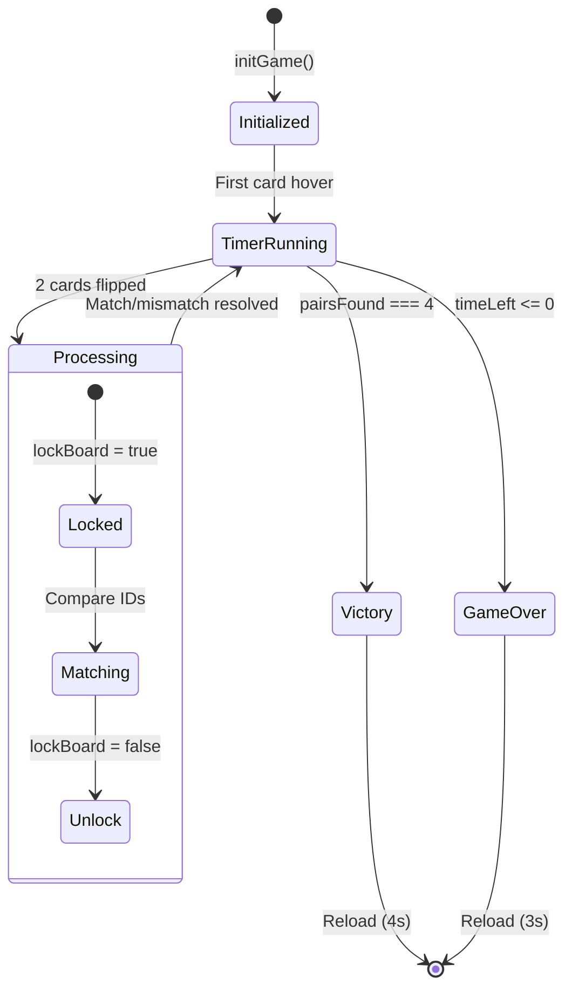

## Core State Variables

### DOM References

Elements selected at game initialization:

<ParamField path="board" type="Element">
  Reference to the `#board` entity where cards are appended
  
  ```javascript
  const board = document.querySelector('#board');
  ```
</ParamField>

<ParamField path="timerText" type="Element">
  Reference to the `#timerText` element for updating countdown display
  
  ```javascript
  const timerText = document.querySelector('#timerText');
  ```
</ParamField>

<ParamField path="statusText" type="Element">
  Reference to the `#statusText` element for win/lose messages
  
  ```javascript
  const statusText = document.querySelector('#statusText');
  ```
</ParamField>

<ParamField path="deathOverlay" type="Element">
  Reference to the `#deathOverlay` plane for death screen fade effect
  
  ```javascript
  const deathOverlay = document.querySelector('#deathOverlay');
  ```
</ParamField>

## Game State

### Timer State

<ResponseField name="timeLeft" type="number" default="40">
  Seconds remaining before game over. Decrements every second.
  
  ```javascript
  let timeLeft = 40;
  ```
  
  **Updated by**: `startTimer()` via `setInterval`  
  **Game over when**: `timeLeft <= 0`
</ResponseField>

<ResponseField name="timerInterval" type="number | undefined">
  Interval ID returned by `setInterval` for the countdown timer.
  
  ```javascript
  let timerInterval;
  ```
  
  **Set by**: `startTimer()`  
  **Cleared by**: `die()` and `win()`
</ResponseField>

### Game Progress

<ResponseField name="gameActive" type="boolean" default="false">
  Whether the game timer has started. Prevents multiple timer starts.
  
  ```javascript
  let gameActive = false;
  ```
  
  **Set to true**: On first card hover (via `startTimer()`)  
  **Checked by**: `startTimer()` to prevent duplicate timers
</ResponseField>

<ResponseField name="pairsFound" type="number" default="0">
  Count of matched pairs found. Win condition at 4 pairs.
  
  ```javascript
  let pairsFound = 0;
  ```
  
  **Incremented by**: `flip()` when cards match  
  **Win condition**: `pairsFound === 4`
</ResponseField>

### Board Lock State

<ResponseField name="lockBoard" type="boolean" default="false">
  Master lock preventing card interactions during animations.
  
  ```javascript
  let lockBoard = false; // LLAVE MAESTRA PARA EVITAR TRABAS
  ```
  
  **Purpose**: Prevents clicking cards while processing a pair  
  **Set to true**: When 2 cards are flipped  
  **Set to false**: After match/mismatch animation completes  
  **Checked by**: `mouseenter` event listener
</ResponseField>

<Accordion title="Lock Board Flow Diagram">
  ```mermaid
  graph TD
    A[Card Hover] --> B{lockBoard?}
    B -->|true| C[Ignore]
    B -->|false| D{Already Flipped?}
    D -->|true| C
    D -->|false| E[Flip Card]
    E --> F{2 Cards Flipped?}
    F -->|no| G[Wait for Next]
    F -->|yes| H[lockBoard = true]
    H --> I{Match?}
    I -->|yes| J[Animate Out]
    I -->|no| K[Animate Back]
    J --> L[lockBoard = false]
    K --> L
  ```
</Accordion>

## Card Data

### Card Identifiers

<ResponseField name="cardData" type="string[]">
  Array of image IDs for all 8 cards (4 pairs).
  
  ```javascript
  const cardData = ['img1', 'img1', 'img2', 'img2', 'img3', 'img3', 'img4', 'img4'];
  ```
  
  **Structure**:
  - Length: 8 cards
  - 4 unique images, each appearing twice
  - IDs correspond to `` assets in `<a-assets>`
  
  **Shuffled by**: `initGame()` using `sort(() => Math.random() - 0.5)`
</ResponseField>

### Flipped Cards Tracking

<ResponseField name="flippedCards" type="Element[]" default="[]">
  Array holding currently flipped card elements (max 2).
  
  ```javascript
  let flippedCards = [];
  ```
  
  **Populated by**: `flip()` pushes cards  
  **Checked by**: `flip()` when `flippedCards.length === 2`  
  **Cleared by**: After match/mismatch processing
</ResponseField>

<Tabs>
  <Tab title="Match Flow">
    ```javascript
    if (card1.dataset.id === card2.dataset.id) {
      // ES PAR
      setTimeout(() => {
        card1.setAttribute('animation', 'property: scale; to: 0 0 0; dur: 300');
        card2.setAttribute('animation', 'property: scale; to: 0 0 0; dur: 300');
        pairsFound++;
        flippedCards = []; // Clear
        lockBoard = false;
        if (pairsFound === 4) win();
      }, 600);
    }
    ```
  </Tab>
  <Tab title="Mismatch Flow">
    ```javascript
    else {
      // NO ES PAR
      setTimeout(() => {
        card1.setAttribute('animation', 'property: rotation; to: 0 0 0; dur: 250');
        card2.setAttribute('animation', 'property: rotation; to: 0 0 0; dur: 250');
        setTimeout(() => {
          card1.setAttribute('src', '#back');
          card2.setAttribute('src', '#back');
          card1.dataset.flipped = "false";
          card2.dataset.flipped = "false";
          flippedCards = []; // Clear
          lockBoard = false;
        }, 125);
      }, 800);
    }
    ```
  </Tab>
</Tabs>

## Card Dataset Attributes

Each dynamically created card has custom data attributes:

<ResponseField name="card.dataset.id" type="string">
  Image identifier for the card face.
  
  **Possible values**: `'img1'`, `'img2'`, `'img3'`, `'img4'`  
  **Set by**: `initGame()` when creating cards  
  **Used by**: `flip()` to compare matches
  
  ```javascript
  card.dataset.id = imgId; // e.g., 'img2'
  ```
</ResponseField>

<ResponseField name="card.dataset.flipped" type="string">
  String boolean tracking flip state.
  
  **Possible values**: `'true'` or `'false'` (string, not boolean)  
  **Initial value**: `'false'`  
  **Set to 'true'**: When card flips  
  **Reset to 'false'**: On mismatch or game reset  
  **Checked by**: `mouseenter` to prevent re-flipping
  
  ```javascript
  card.dataset.flipped = "false";
  if (this.dataset.flipped === "true") return; // Already flipped
  ```
</ResponseField>

## Game Functions

### Core Functions

<ResponseField name="initGame()" type="function">
  Initializes the game board with shuffled cards.
  
  **Actions**:
  1. Clears `board.innerHTML`
  2. Shuffles `cardData` array
  3. Creates 8 `<a-box>` card elements
  4. Positions cards in 4x2 grid
  5. Attaches `mouseenter` event listeners
  6. Appends cards to board
  
  **Called**: On page load (line 164)
  
  ```javascript
  function initGame() {
    board.innerHTML = '';
    const shuffled = [...cardData].sort(() => Math.random() - 0.5);
    shuffled.forEach((imgId, index) => {
      // Card creation logic...
    });
  }
  ```
</ResponseField>

<ResponseField name="startTimer()" type="function">
  Starts the 40-second countdown timer and background music.
  
  **Behavior**:
  - Only runs once (checked via `gameActive`)
  - Sets `gameActive = true`
  - Starts background music
  - Creates 1-second interval to decrement `timeLeft`
  - Calls `die()` when `timeLeft <= 0`
  
  **Triggered**: On first card `mouseenter`
  
  ```javascript
  function startTimer() {
    if(!gameActive) {
      gameActive = true;
      document.querySelector('#bgMusic').components.sound.playSound();
      timerInterval = setInterval(() => {
        timeLeft--;
        timerText.setAttribute('value', `VIDA: ${timeLeft}s`);
        if(timeLeft <= 0) die();
      }, 1000);
    }
  }
  ```
</ResponseField>

<ResponseField name="flip(card)" type="function">
  Flips a card and checks for matches.
  
  **Parameters**:
  - `card` (Element): The card element to flip
  
  **Actions**:
  1. Sets `card.dataset.flipped = "true"`
  2. Pushes card to `flippedCards` array
  3. Animates rotation (0° → 180°)
  4. Changes `src` to card face after 125ms
  5. If 2 cards flipped:
     - Sets `lockBoard = true`
     - Checks match via `dataset.id`
     - Animates match (scale to 0) or mismatch (flip back)
     - Resets state and unlocks board
  
  ```javascript
  function flip(card) {
    card.dataset.flipped = "true";
    flippedCards.push(card);
    card.setAttribute('animation', 'property: rotation; to: 0 180 0; dur: 250');
    setTimeout(() => card.setAttribute('src', '#' + card.dataset.id), 125);
    
    if (flippedCards.length === 2) {
      lockBoard = true;
      // Match logic...
    }
  }
  ```
</ResponseField>

### End Game Functions

<ResponseField name="die()" type="function">
  Handles game over (time ran out).
  
  **Actions**:
  1. Clears timer interval
  2. Sets status text: "PERDISTE TU ALMA"
  3. Animates death overlay to opacity 1 (1 second)
  4. Reloads page after 3 seconds
  
  ```javascript
  function die() {
    clearInterval(timerInterval);
    statusText.setAttribute('value', 'PERDISTE TU ALMA');
    deathOverlay.setAttribute('animation', 'property: material.opacity; to: 1; dur: 1000');
    setTimeout(() => location.reload(), 3000);
  }
  ```
</ResponseField>

<ResponseField name="win()" type="function">
  Handles victory (all 4 pairs found).
  
  **Actions**:
  1. Clears timer interval
  2. Sets status text: "SALISTE CON VIDA"
  3. Reloads page after 4 seconds
  
  **Triggered**: When `pairsFound === 4`
  
  ```javascript
  function win() {
    clearInterval(timerInterval);
    statusText.setAttribute('value', 'SALISTE CON VIDA');
    setTimeout(() => location.reload(), 4000);
  }
  ```
</ResponseField>

## Event Handlers

### Card Hover Event

Attached to each card during `initGame()`:

```javascript
card.addEventListener('mouseenter', function() {
  // Si el tablero está bloqueado o la carta ya se giró, NO HACER NADA
  if (lockBoard || this.dataset.flipped === "true" || timeLeft <= 0) return;
  
  startTimer();
  new Audio(document.querySelector('#click-sound').src).play();
  flip(this);
});
```

**Conditions checked**:
1. `lockBoard === false` (no pair being processed)
2. `this.dataset.flipped === "false"` (card not already flipped)
3. `timeLeft > 0` (game still active)

**Actions**:
1. Starts timer (first hover only)
2. Plays click sound
3. Calls `flip(this)`

## State Flow Chart



## See Also

<CardGroup cols={2}>
  <Card title="A-Frame Components" icon="cube" href="/reference/aframe-components">
    HTML entities and attributes
  </Card>
  <Card title="Animations" icon="film" href="/reference/animations">
    Animation timings referenced in state transitions
  </Card>
</CardGroup>